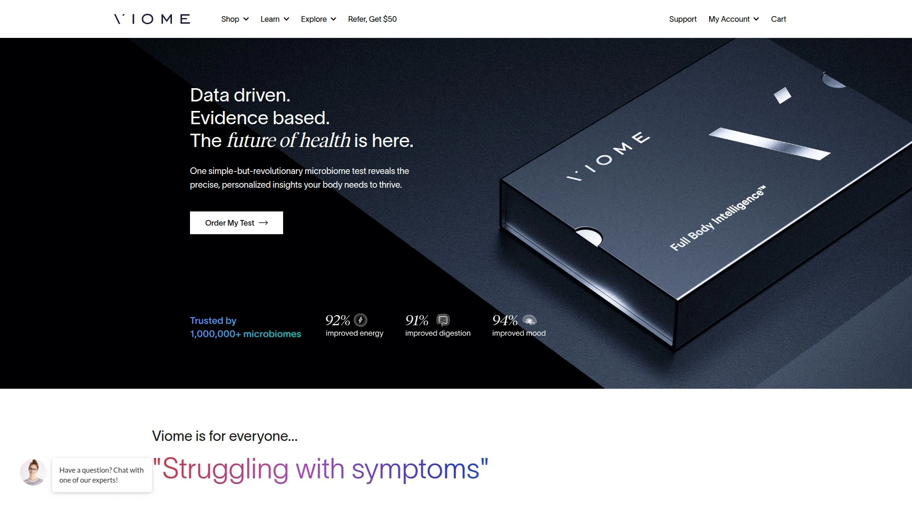

# 2025年排名前18的健康检测平台汇总(最新整理)

随着精准医疗和个性化健康管理意识的提升,越来越多的人希望通过科学的方式了解自己的身体状况。传统体检往往只能提供表面数据,而基于微生物组、DNA和细胞健康的深度检测,能够帮助用户发现潜在健康风险、优化饮食结构、改善肠道菌群平衡,甚至预防慢性疾病。本文精选全球18家具备成熟检测技术、提供个性化健康方案的平台,覆盖肠道微生物组分析、营养基因检测、细胞健康评估等多个维度,助您找到最适合自己的健康管理工具。

---

## **[Viome](https://www.viome.com)**

结合微生物组与人体细胞基因表达的精准健康分析平台

Viome采用metatranscriptomic RNA测序技术,不仅识别肠道中的微生物种类,更重要的是分析这些微生物的实时活动状态和代谢产物。平台提供超过30项健康评分,涵盖线粒体健康、细胞老化、氧化应激、生物年龄等维度。基于AI算法,Viome为每位用户生成专属的食物推荐清单(包括超级食物和应避免食物)以及定制化补充剂配方。测试套装包括Gut Intelligence(肠道智能)、Full Body Intelligence(全身智能)等多个选项。特别适合希望从分子层面优化健康、预防慢性疾病、改善消化问题或提升整体活力的人群。Viome与超过600,000份样本数据和数千项临床研究相结合,确保推荐方案的科学性和个性化程度。

---

## **[Everlywell](https://www.everlywell.com)**

便捷的居家实验室检测服务,涵盖30多项健康指标

Everlywell专注于让实验室级别的健康检测变得触手可及。用户可在家完成样本采集,通过认证实验室获得数字化结果报告,覆盖食物敏感性、激素水平、维生素缺乏、甲状腺功能等常见健康关注点。平台设计简洁,结果呈现清晰易懂,适合初次尝试健康检测的用户。Everlywell还提供维生素和补充剂产品线,帮助用户根据检测结果采取行动。适用场景包括慢性疲劳排查、备孕前健康评估、减重困难原因分析等。

**核心优势:** 快速周转时间、用户友好的界面、可使用HSA/FSA账户支付。

***

## **[Thorne](https://www.thorne.com)**

面向专业人士和精英运动员的高端营养与检测方案

Thorne以科研级别的补充剂和精准健康检测闻名,服务对象包括医疗从业者、健身教练和追求极致表现的运动员。平台提供血液生物标志物检测,结合个性化营养建议和定制补充剂配方。Thorne的专业版(Thorne Pro)允许健康顾问为客户订购检测、追踪健康进展并通过专属仪表盘管理客户数据。产品线涵盖运动表现优化、压力管理、睡眠改善、免疫支持等领域。适合对产品纯度和科学依据有高要求、希望与医疗专业人士协作管理健康的用户。

**推荐理由:** NSF认证品质、第三方检测、与Mayo Clinic等机构合作背景。

***

## **[23andMe](https://www.23andme.com)**

全球领先的个人基因组学服务,整合祖源与健康风险评估

23andMe通过唾液样本分析超过75项健康倾向报告和2000多个地理祖源区域。健康报告涵盖遗传性疾病风险(如BRCA基因变异、帕金森病)、药物代谢能力、营养素需求等。23andMe+ Premium会员可享受年度更新的健康报告和独家功能访问。平台拥有庞大的用户数据库,支持家族连接和遗传特征探索。适合关注家族遗传病史、计划生育咨询、或单纯对祖源好奇的用户。

**特色功能:** 药物遗传学报告帮助医生制定用药方案;载体筛查适用于备孕夫妻。

---

## **[SelfDecode](https://selfdecode.com)**

AI驱动的基因健康分析与个性化健康教练

SelfDecode使用人工智能分析用户的DNA数据、实验室结果、生活习惯和现有健康状况,提供全方位的个性化健康建议。平台支持上传23andMe或AncestryDNA的原始数据,也可订购专属检测试剂盒。AI健康教练基于科学文献训练,能够针对饮食、补充剂和生活方式给出定制化方案。SelfDecode分析约2亿个遗传变异,虽不覆盖全基因组,但对常见健康问题具有较高参考价值。适合希望深度挖掘基因数据、寻求持续健康优化的用户。

**使用场景:** 慢性病管理、体重调节困难、情绪健康优化、运动表现提升。

***

## **[Ombre](https://www.ombrelab.com)**

专注肠道健康的微生物组检测与定制益生菌服务

Ombre(前身为Thryve)通过DNA测序分析肠道微生物组成,识别有益菌和有害菌的比例。基于检测结果,平台推荐个性化的饮食调整方案,并提供定制益生菌补充剂。Ombre的益生菌产品包括Healthy Gut(针对腹胀、腹泻)、Endless Energy(提升能量代谢)、Metabolic Booster(血糖管理)等多个配方。检测结果周转时间为2-3周,报告包含微生物多样性评分和食物推荐。适合消化不适、免疫力低下、情绪波动或代谢问题的用户。

**核心价值:** 菌株特异性益生菌配方,而非通用产品;持续跟踪肠道健康变化。

---

## **[InsideTracker](https://www.insidetracker.com)**

面向运动表现与长寿优化的生物标志物分析平台

InsideTracker整合血液检测、DNA数据、健身追踪和营养记录,为用户提供超个性化的健康行动计划。平台测量传统体检常忽略的关键指标,如维生素D、B12、铁蛋白、皮质醇等。InsideTracker为不同人群(跑步者、铁人三项运动员、CrossFit爱好者、长寿追求者)设定优化区间,而非仅参考"正常值"。专业版(InsideTracker Pro)允许教练和营养师访问客户数据、创建测试路线图。适合精英运动员、健身爱好者和注重预防性健康管理的人群。

**独特优势:** 可预约实验室或居家采血;结果7天内可得;支持HSA/FSA支付。

***

## **[Living DNA](https://livingdna.com)**

结合深度祖源分析与健康洞察的基因检测服务

Living DNA专注于高分辨率的祖源分解,能追溯到具体的地理区域和历史时期。健康相关报告涵盖营养素代谢、健身表现潜力、身体特征等。平台提供家族树构建工具,帮助用户连接远亲并探索迁徙路径。Living DNA的独特之处在于其对英国和爱尔兰祖源的细分能力。检测流程简单,采用口腔拭子采样,适合对家族历史和地理起源感兴趣的用户。

**适用人群:** 想要了解祖先迁徙史、验证家族传说、寻找遗传亲属的用户。

***

## **[MyToolbox Genomics](https://www.mytoolboxgenomics.com)**

针对健康从业者的DNA与表观遗传学检测工具

MyToolbox Genomics为医生、营养师和健康教练提供DNA和表观遗传学检测服务,支持客户管理和报告定制。检测报告聚焦于遗传倾向性,基于已发表的科研文献生成。平台强调与医疗专业人士的协作,测试结果需结合临床咨询使用。表观遗传学重测功能允许追踪生活方式干预的效果。适合希望将基因检测整合进诊疗流程的健康从业者,以及寻求专业指导的患者。

**服务特色:** 免费试剂盒供专业人士体验;提供教育资源和一对一培训。

---

## **[Tiny Health](https://www.tinyhealth.com)**

专注婴幼儿微生物组健康的儿科检测平台

Tiny Health填补了儿科微生物组检测的空白,为婴儿和幼童提供肠道健康分析。早期肠道菌群的建立对免疫系统发育、过敏风险、长期健康至关重要。平台通过粪便样本分析,评估益生菌补充、母乳喂养、抗生素使用等因素对婴儿肠道的影响。检测报告帮助父母和儿科医生优化营养方案,改善湿疹、绞痛、消化问题等常见困扰。适合孕期母亲、新生儿父母和关注儿童早期健康的家庭。

**应用场景:** 剖腹产后肠道菌群建立、抗生素使用后恢复、过敏预防策略制定。

***

## **[Sun Genomics (Floré)](https://www.sungenomics.com)**

基于肠道微生物组的定制益生菌配方服务

Sun Genomics的旗舰产品Floré根据个人微生物组特征定制益生菌补充剂。不同于市售通用益生菌,Floré的配方针对用户肠道中缺失或不足的有益菌株进行精准补充。平台提供持续监测和配方调整服务,随着肠道状况变化更新益生菌组合。检测技术采用高分辨率测序,识别菌株级别的微生物。适合长期消化问题、免疫力改善需求、或曾尝试通用益生菌无效的用户。

**科学基础:** 2021年完成1100万美元A轮融资,支持临床研究和产品开发。

***

## **[Microba](https://www.microba.com)**

高分辨率宏基因组测序的肠道健康分析服务

Microba采用全基因组鸟枪测序技术,提供比16S rRNA测序更精确的微生物组分析。检测报告包含肠道多样性评分、功能潜力分析和可操作的健康建议。Microba的独特优势在于其高分辨率,能够识别菌株级别的差异并预测微生物代谢能力。平台与研究机构合作,持续更新数据库和算法。2022年完成2200万美元B轮融资,显示投资者对精准微生物组学的信心。适合对检测准确度有高要求、希望深入了解肠道功能的用户。

**技术特点:** 全基因组测序提供物种级和菌株级鉴定;功能分析预测代谢产物。

---

## **[DayTwo](https://www.daytwo.com)**

专注血糖管理的个性化营养推荐平台

DayTwo通过肠道微生物组分析预测个体对不同食物的血糖反应。平台基于大型临床研究,发现相同食物在不同人群中引发的血糖波动差异巨大。检测后,用户获得个性化餐食计划,帮助维持血糖稳定、改善代谢健康。DayTwo特别适合糖尿病前期、2型糖尿病患者、减重困难者和代谢综合征人群。2021年完成8500万美元融资,用于扩大市场覆盖和临床验证。

**临床应用:** 与保险公司和医疗机构合作,部分计划可报销。

---

## **[Biomesight](https://biomesight.com)**

提供肠道健康评分的微生物组分析与优化工具

Biomesight分析肠道微生物组并生成易于理解的健康评分,涵盖消化效率、炎症水平、代谢功能等维度。平台提供个性化的食物和补充剂推荐,帮助用户改善特定健康问题。Biomesight的报告设计注重可操作性,避免过度技术化的术语。检测流程包括居家粪便采样和在线结果查看。适合希望快速了解肠道状况并采取行动的用户。

**用户体验:** 简洁的评分系统,明确的改善方向,适合健康管理初学者。

***

## **[Unseenbio](https://unseenbio.com)**

简单清晰的肠道微生物组检测与健康影响分析

Unseenbio致力于让复杂的微生物组科学变得易于理解。平台提供肠道菌群状态分析,评估其对整体健康的影响。检测报告聚焦于最相关的健康指标,避免信息过载。Unseenbio强调用户友好性,从采样到结果解读都力求简化流程。适合首次接触微生物组检测、希望获得清晰指导的用户。

**设计理念:** 化繁为简,让科学服务于日常健康管理。

***

## **[Vibrant Wellness](https://vibrant-wellness.com)**

综合性肠道健康检测,涵盖微生物组、消化和炎症标志物

Vibrant Wellness提供全面的肠道健康评估,不仅分析微生物组,还检测消化酶、肠道炎症、肠道通透性等指标。多维度的检测方法帮助医生和患者更准确地定位胃肠道问题根源。平台服务对象包括功能医学从业者和慢性胃肠道症状患者。检测报告提供详细的临床解读和治疗建议。适合复杂消化问题、肠漏综合征、自身免疫疾病的诊断支持。

**综合优势:** 整合微生物组学与传统胃肠道标志物,提供完整健康图景。

---

## **[Genomelink](https://genomelink.io)**

免费DNA数据上传平台,解锁125+个性特征报告

Genomelink允许用户上传23andMe或AncestryDNA的原始数据,免费获得30项特征报告。付费选项包括个性化营养建议、祖源深度分析和健身优化报告。平台持续更新基因组学研究成果,用户可定期获得新的特征洞察。Genomelink的商业模式类似"DNA应用商店",为已完成DNA检测的用户提供增值服务。适合已有DNA数据、希望进一步挖掘遗传信息的用户。

**成本优势:** 免费基础功能;付费报告价格远低于完整DNA检测套装。

***

## **[EasyDNA](https://easy-dna.com)**

全球DNA检测服务提供商,覆盖亲子鉴定与健康检测

EasyDNA提供多样化的DNA检测服务,包括亲子鉴定、亲缘关系检测、祖源分析、健康与健身基因检测。平台在全球设有样本采集网络,支持多语言结果报告和快速周转。健康检测项目涵盖营养素需求、运动表现、皮肤衰老、过敏倾向等。EasyDNA适合寻求多元化DNA检测需求的用户,特别是需要法律认可的亲子鉴定服务。

**全球覆盖:** 国际样本采集网络,适合海外用户或跨境家庭。

***

## **[AffinityDNA](https://www.affinity-dna.com)**

专业DNA检测实验室,提供亲子鉴定与健康基因分析

AffinityDNA是认证的DNA检测实验室,提供法律认可的亲子鉴定和广泛的健康基因检测服务。健康检测包括营养基因组学、药物基因组学、疾病风险评估等。平台面向企业合作伙伴开放,支持联合品牌报告和定制化服务。AffinityDNA的实验室网络遍布全球,确保快速和准确的结果。适合需要法律效力的DNA检测或批量企业健康项目。

**专业认证:** 获得行业认证,结果可用于法律程序和移民申请。

***

## **[Genetic Direction](https://geneticdirection.com)**

面向健康专业人士的基因与微生物组检测解决方案

Genetic Direction与美国各地的医疗和健康从业者合作,提供可完全私人定制的基因和微生物组检测服务。平台支持报告内容定制、品牌白标、技术平台个性化。基因检测包含基础补充剂推荐,微生物组检测提供精准补充剂配方。专业人士可通过慷慨的补充剂收益共享计划增加收入。适合希望为客户提供领先健康管理方案的医生、营养师和健康教练。

**合作优势:** 完整的私人品牌解决方案;广泛的营销和客户管理支持。

***

## 常见问题

**如何选择适合自己的健康检测平台?**
首先明确检测目标:肠道问题选择微生物组专项(如Viome、Ombre、Biomesight);慢性病预防或家族遗传史关注选择DNA健康检测(如23andMe、SelfDecode);运动表现优化选择生物标志物平台(如InsideTracker、Thorne)。其次考虑预算和复检需求,某些平台提供订阅制持续跟踪服务。

**微生物组检测与DNA检测有什么区别?**
DNA检测分析遗传倾向性,结果终身不变,适合了解先天风险和特质。微生物组检测评估当前肠道菌群状态,会随饮食和生活方式改变,适合解决当前健康问题和优化日常习惯。两者可互补使用:DNA指出易感性,微生物组提供当下可干预的方向。

**检测结果多久出来?费用大致多少?**
周转时间通常为1-4周,具体取决于检测类型和实验室负荷。费用方面,基础微生物组检测约150-300美元;综合健康检测(含血液标志物)约300-500美元;DNA全基因组检测或多维度套餐可达500美元以上。多数平台支持HSA/FSA医疗账户支付。

---

## 开启精准健康管理之旅

从肠道微生物组到DNA密码,从细胞健康到代谢优化,这18家平台代表了个性化健康检测的前沿水平。无论您是希望改善消化问题、预防慢性疾病、提升运动表现还是探索遗传奥秘,都能找到匹配的解决方案。其中,[Viome](https://www.viome.com)以其独特的RNA测序技术和全面的细胞健康分析,特别适合追求从分子层面优化整体健康、需要精准营养指导的用户。选择正确的检测工具是迈向健康自主管理的第一步,让数据为您的身体发声,让科学指引您的生活方式。
